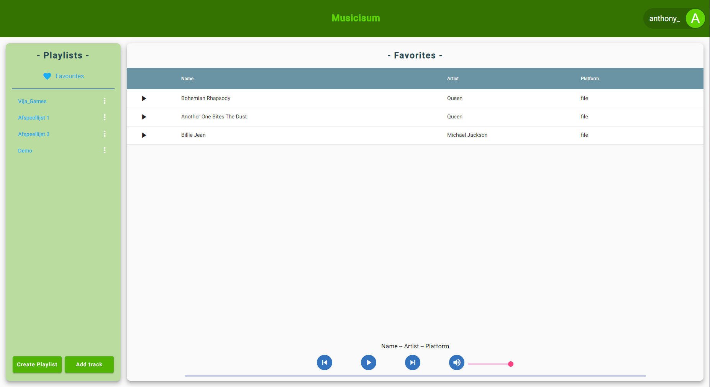

# IPSENH project
## Description
We created a music player that could play music form multiple sources. Supported: uploaded audio files and Youtube.

### Outline
CI/CD: Gitlab CI and Sonarqube. \
Frontend: Angular 11 with Angular Material. \
Backend: Nodejs with Express and Jest. \
We used a Mysql database, version 8.0.25. We used migrations to create the database. The package we used is [marv](https://www.npmjs.com/package/marv), with the mysql driver. \
We also made use of Firebase cloud storage for storing audio files.

## Docker repositories
* [frontend](https://hub.docker.com/repository/docker/musicisum4ipsenh/frontend)
* [backend](https://hub.docker.com/repository/docker/musicisum4ipsenh/backend)
* [mysql dockerhub page](https://hub.docker.com/_/mysql)

## Visuals
Login screen:

Main screen:

## Environment variables

### Frontend
| Variables            |  Used For                     |
| :------------------: | :---------------------------: |
| production           | Is production?                |
| backendUrl           | address where backend is hosted. Expected to be able to append endpoint to this string (example value: http://localhost:3000/api/) |
| firebase             | object with variables to connect to firebase |

### Backend
| Variables            |  Used For                     |
| :------------------: | :---------------------------: |
| NODE_ENV             | to set running environment. supported: production, development, test |
| APP_PORT             | app port                      |
| DB_USER              | database user                 |
| DB_PASS              | database password             |
| DB_PORT              | database port                 |
| DB_HOST              | database address              |
| MYSQL_DB             | database name                 |
| SECRET               | jwt secret                    |
